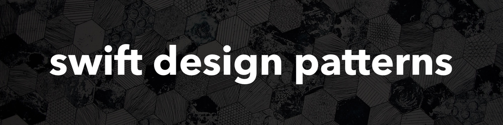

# swift-design-patterns 

**Last Update: 23/September/2018.**

# ✍️ About 
🚀 The ultimate collection of various `Software Design Patterns` implemented using `Swift Programming Language`.  This repository aims to collect as many design patterns as possbile with examples and to serve as a reference material for eveyone who is willing to learn something new.

# ☢️ Disclamer
The motivation behind this porject is to help the others to learn by compiling the knowlege that I have. The material to write down is enourmous, sometimes I may formalize my thoughts in a way that looks strange or unclear. I provide reference materials, so you are able to take a look at the same patterns but from a different perspective or original source. 

If you find that something is not clear or has an issue, please, don't judge immediately in a negative way. It's an open source and you have such an opportunity to polietly tell me about that or even create a pool request (which is the best way to contribute). The other piece of motivation is that I really want to create learning material that is `solid` and yet `easy` to understand for developers that know basics of `OOP` and `POP` paradigms (since it's `Swift` and `POP` is almost as important as `OOP` IMHO).

I want to keep this repo up to date, implement the latest design, architecture and concurrency patterns. Open-source for eveyone :octocat:

# 📚 List of Contents

## 🏗 Common Design Patterns

### Behavioral
> Behavioral design patterns are design patterns that identify common communication patterns between objects and realize these patterns. By doing so, these patterns increase flexibility in carrying out this communication.
>
> **Source:** [wikipedia.org](http://en.wikipedia.org/wiki/Behavioral_pattern)

#### Gang of Four

- **Chain of Responsibility:** command objects are handled or passed on to other objects by logic-containing processing objects
- [**Command:**](/Common%20Design%20Patterns/Behavioral/Command/Command.md) command objects encapsulate an action and its parameters
- **Interpreter:** implement a specialized computer language to rapidly solve a specific set of problems
- [**Iterator:**](/Common%20Design%20Patterns/Behavioral/Iterator/Iterator.md) iterators are used to access the elements of an aggregate object sequentially without exposing its underlying representation
- **Mediator:** provides a unified interface to a set of interfaces in a subsystem
- [**Memento:**]() provides the ability to restore an object to its previous state (rollback)
- [**Observer:**](/Common%20Design%20Patterns/Behavioral/Observer/Observer.md) objects register to observe an event that may be raised by another object. The pattern has similarities with `Publish/Subscribe` and `Multicast Delegate`patterns
- **State:** a clean way for an object to partially change its type at runtime
- [**Strategy:**](/Common%20Design%20Patterns/Behavioral/Strategy/Strategy.md) algorithms can be selected on the fly, using composition
- **Template Method:** describes the program skeleton of a program; algorithms can be selected on the fly, using inheritance
- **Visitor:** a way to separate an algorithm from an object

#### Other

- **Externalize the Stack:** turn a recursive function into an iterative one that uses a stack
- [**Null Object:**](/Common%20Design%20Patterns/Behavioral/NullObject/NullObject.md) designed to act as a default value of an object
- **Weak Reference:** de-couple an observer from an observable
- **Protocol Stack:** communications are handled by multiple layers, which form an encapsulation hierarchy
- **Scheduled-Task:** a task is scheduled to be performed at a particular interval or clock time (used in real-time computing)
- **Single-Serving Visitor:** optimise the implementation of a visitor that is allocated, used only once, and then deleted
- **Specification:** recombinable business logic in a boolean fashion
- **Publish/Subscribe:** messaging pattern where senders of messages, called publishers, do not program the messages to be sent directly to specific receivers, called subscribers, but instead categorize published messages into classes without knowledge of which subscribers, if any, there may be. The pattern has similarities with `Observer`, `Event Listener` and `Multicast Delegation`, however it has its differences and weaknesses as well
- **Event Listener:** NO DESCRIPTION YET (has differences in comparison to *Observer* and *Publish/Subscribe* patterns - need to formalize it in a sentence or so) 

### Creational 
> Creational design patterns are design patterns that deal with object creation mechanisms, trying to create objects in a manner suitable to the situation. The basic form of object creation could result in design problems or in added complexity to the design. Creational design patterns solve this problem by somehow controlling this object creation.
>
> **Source:** [wikipedia.org](https://en.wikipedia.org/wiki/Creational_pattern)

#### Gang of Four

- [**Abstract Factory:**](/Common%20Design%20Patterns/Creational/AbstractFactory/AbstractFactory.md) a class requests the objects it requires from a factory object instead of creating the objects directly
- [**Factory Method:**](/Creational/FactoryMethod/FactoryMethod.md) centralize creation of an object of a specific type choosing one of several implementations
- [**Builder:**](/Common%20Design%20Patterns/Creational/Builder/Builder.md) separates the construction of a complex object from its representation so that the same construction process can create different representations
- [**Prototype:**](/Common%20Design%20Patterns/Creational/Prototype/Prototype.md) used when the type of objects to create is determined by a prototypical instance, which is cloned to produce new objects
- [**Singleton:**](/Common%20Design%20Patterns/Creational/Singleton/Sinpleton.md) restrict instantiation of a class to one object

#### Other 

- [**Dependency Injection:**](/Common%20Design%20Patterns/Creational/DependencyInjection/DependencyInjection.md) a type accepts the objects it requires from an injector instead of creating the objects directly
- [**Lazy Initialization:**](/Common%20Design%20Patterns/Creational/LazyInitialization/LazyInitialization.md) tactic of delaying the creation of an object, the calculation of a value, or some other expensive process until the first time it is needed
- [**Object Pool:**](/Common%20Design%20Patterns/Creational/ObjectPool/ObjectPool.md) avoid expensive acquisition and release of resources by recycling objects that are no longer in use
- **Simple Factory:** NO DESCRIPTION YET 
- **Static Factory:** used for instantiation of dependent types. Replaces constructors/initializers for object creation that provides additional capabilities such as caching and/or throwing an error

### Structural 
> Structural design patterns are design patterns that ease the design by identifying a simple way to realize relationships between entities.
>
> **Source:** [wikipedia.org](https://en.wikipedia.org/wiki/Structural_pattern)

#### Gang of Four

- [**Adapter:**]() 'adapts' one interface for a class into one that a client expects
- [**Bridge:**](/Common%20Design%20Patterns/Structural/Bridge/Bridge.md) decouple an abstraction from its implementation so that the two can vary independently
- **Composite:** a tree structure of objects where every object has the same interface
- **Decorator:** allows behavior to be added to an individual object, dynamically, without affecting the behavior of other objects from the same class
- [**Facade:**](/Common%20Design%20Patterns/Structural/Facade/Facade.md) create a simplified interface of an existing interface to ease usage for common tasks
- **Flyweight:** a large quantity of objects share a common properties object to save space
- [**Proxy:**](/Common%20Design%20Patterns/Structural/Proxy/Proxy.md) a class functioning as an interface to another thing

#### Other 

- **Adapter Pipeline:** use multiple adapters for debugging purposes.
- **Retrofit Interface:** an adapter used as a new interface for multiple classes at the same time.
- **Aggregate pattern:** a version of the Composite pattern with methods for aggregation of children
- **Tombstone:** an intermediate "lookup" object contains the real location of an object.
rise of new classes
- **Extensibility:** a.k.a. `Framework` - hide complex code behind a simple interface
- [**Marker:**](/Common%20Design%20Patterns/Structural/Marker/Marker.md) an empty interface (or protocol) to associate metadata with a class.
- **Pipes and Filters:** a chain of processes where the output of each process is the input of the next
- **Opaque Pointer:** a pointer to an undeclared or private type, to hide implementation details
- [**Delegation:**](/Common%20Design%20Patterns/Structural/Delegation/Delegation.md) allows object composition to achieve the same code reuse as inheritance
- [**Multicast Delegatation:**](/Common%20Design%20Patterns/Structural/MulticastDelegation/MulticastDelegation.md) advanced version of `Delegate pattern` which allows multiple delegates to be notified about method calls
- [**Coordinator:**](/Common%20Design%20Patterns/Structural/Coordinator/Coordinator.md) is and object that encapsulates lifecycle that is spread over a collection of view controllers
- **Humble Object:** extracts the logic into a separate easy-to-test component that is decoupled from its environment

## 🚅 Concurrency Design Patterns
> Concurrency patterns are those types of design patterns that deal with the multi-threaded programming paradigm.
>
> **Source:** [wikipedia.org](https://en.wikipedia.org/wiki/Concurrency_pattern)

- **Active Object:** decouples method execution from method invocation for objects that each reside in their own thread of control
- **Balking Pattern:** executes an action on an object when the object is in a particular state
- **Barrier:** is a type of synchronization method. A barrier for a group of threads or processes in the source code means any thread/process must stop at this point and cannot proceed until all other threads/processes reach this barrier
- **Double-Checked Locking:** used to reduce the overhead of acquiring a lock by first testing the locking criterion (the "lock hint") without actually acquiring the lock. Only if the locking criterion check indicates that locking is required does the actual locking logic proceed.
- **Guarded Suspension:** manages operations that require both a lock to be acquired and a precondition to be satisfied before the operation can be executed
- **Monitor Object:** is a synchronization construct that allows threads to have both mutual exclusion and the ability to wait (block) for a certain condition to become true
- **Nuclear Reaction:** is a type of computation which allows threads to either spawn new threads or converge many threads to one
- **Reactor:** is an event handling pattern for handling service requests delivered concurrently to a service handler by one or more inputs
- [**Read Write Lock:**](/Concurrency%20Design%20Patterns/ReadWriteLock/ReadWriteLock.md) allows concurrent access for read-only operations, while write operations require exclusive access
- **Scheduler:** is the method by which work specified by some means is assigned to resources that complete the work
- **Thread Pool:** maintains multiple threads waiting for tasks to be allocated for concurrent execution by the supervising program
- **Thread-Local Storage:** is a computer programming method that uses static or global memory local to a thread

## 🏛 Architectural Patterns
Architectural patterns addres issues that arise in software engineering within certain contexts. They are similar to design patterns, but have broader scope of responsibilities. Architectural patterns structure the way how software product/application/platform is built by separating different abstractions into reusable layers. Sometimes architectural patterns are documented as design patterns.

- **MVC:** is an architectural pattern commonly used for developing user interfaces that divides an application into three interconnected parts. This is done to separate internal representations of information from the ways information is presented to and accepted from the user. The `MVC` design pattern decouples these major components allowing for efficient code reuse and parallel development [[1](#references)]
- **MVP:** is a derivation of the model–view–controller (`MVC`) architectural pattern, and is used mostly for building user interfaces. In `MVP`, the presenter assumes the functionality of the "middle-man". In `MVP`, all presentation logic is pushed to the presenter [[1](#references)]
- **MVVM:** is a software architectural pattern that facilitates a separation of development of the graphical user interface – be it via a markup language or `GUI` code – from development of the business logic or back-end logic (the data model). The view model of `MVVM` is a value converter, meaning the view model is responsible for exposing (converting) the data objects from the model in such a way that objects are easily managed and presented [[1](#references)]
- **MVVM-C:** 
- **VIPER:** `VIPER` is an application of `Clean Architecture` to `iOS` apps. The word `VIPER` is a backronym for `View`, `Interactor`, `Presenter`, `Entity`, and `Routing`. `Clean Architecture` divides an app’s logical structure into distinct layers of responsibility. This makes it easier to isolate dependencies (e.g. your database) and to test the interactions at the boundaries between layers [[8](#references)]
- **DAO:** - `DAO` stands for `Data Access Object`. `DAO` provides abstract interface to a database or other persistence storage mechanism. 

## 🐦 Swift Patterns
> In `Swift`, there are two basic kinds of patterns: those that successfully match any kind of value, and those that may fail to match a specified value at runtime. 
>
>  The first kind of pattern is used for destructuring values in simple variable, constant, and optional bindings. These include wildcard patterns, identifier patterns, and any value binding or tuple patterns containing them. You can specify a type annotation for these patterns to constrain them to match only values of a certain type.
>
>  The second kind of pattern is used for full pattern matching, where the values you’re trying to match against may not be there at runtime. These include enumeration case patterns, optional patterns, expression patterns, and type-casting patterns. You use these patterns in a case label of a switch statement, a catch clause of a do statement, or in the case condition of an if, while, guard, or for-in statement.
>
> **Source:** [`swift.org`](https://docs.swift.org/swift-book/ReferenceManual/Patterns.html#//apple_ref/doc/uid/TP40014097-CH36-ID419)

The following patterns are not part of the topic about `design patterns`. However they have some relation to the topic since they offer reusable solutions for common design scenarious. 

- [**Wildcard:**](/Swift%20Design%20Patterns/Wildcard/Wildcard.md) a wildcard pattern matches and ignores any value and consists of an underscore (_). Use a wildcard pattern when you don’t care about the values being matched against 
- **Identifier:** an identifier pattern matches any value and binds the matched value to a variable or constant name
- **Value-Binding:** a value-binding pattern binds matched values to variable or constant names. Value-binding patterns that bind a matched value to the name of a constant begin with the let keyword; those that bind to the name of variable begin with the var keyword
- **Tuple Pattern:** a tuple pattern is a comma-separated list of zero or more patterns, enclosed in parentheses. Tuple patterns match values of corresponding tuple types
- **Enumeration Case:** an enumeration case pattern matches a case of an existing enumeration type. Enumeration case patterns appear in switch statement case labels and in the case conditions of `if`, `while`, `guard`, and `for-in` statements
- **Optional:** an optional pattern matches values wrapped in a `some(Wrapped)` case of an `Optional<Wrapped>` enumeration. Optional patterns consist of an identifier pattern followed immediately by a question mark and appear in the same places as enumeration case patterns
- **Type-Casting:** there are two type-casting patterns, the is pattern and the as pattern. The is pattern appears only in switch statement case labels
- **Expression:** an expression pattern represents the value of an expression. Expression patterns appear only in `switch` statement `case` labels

# 📝 References
There were used a number of reference materials such as:

1. [Wikipedia](https://www.wikipedia.org)
2. [swift.org](https://www.swift.org)
3. [Apple Developer Portal](https://developer.apple.com)
4. [Design Patterns: Elements of Reusable Object-Oriented Software](http://www.blackwasp.co.uk/GangOfFour.aspx)
5. [SOLID](https://en.m.wikipedia.org/wiki/SOLID)
6. [Swift Patterns](https://developer.apple.com/library/content/documentation/Swift/Conceptual/Swift_Programming_Language/Patterns.html#//apple_ref/doc/uid/TP40014097-CH36-ID419)
7. [Coordinator Pattern](http://khanlou.com/2015/01/the-coordinator/)
8. [VIPER Architecture](https://www.objc.io/issues/13-architecture/viper/)
9. [Code Complete. Wikipedia](https://en.wikipedia.org/wiki/Code_Complete)

# 🙋‍♀️🙋‍♂️ Contributing
You are very welcome to contribute to this project! There are a few rules that need to be followed:

- If you want to implement an example code for an existing `Design Pattern` then you need to wrap it up in `.playground` file. That makes code compilation is a matter of launching a file and not worrying about managing a gigantic `Xcode` project.
- If you want to write about a `Design Pattern` that is in the list, but has not been implemented yet, then you need to follow the following style guide:
  - Write the description of a design pattern
  - Split the example code into subsections
  - Write explanation for each snippet of code
  - Don't make your example complicated and too many details
  - Write conclusion where you highlight the pattern 
- If you want to write about a `Design Pattern` that is not in the list, then please use the aforementioned rules + write a short description and specify the category of a pattern.  
- If you find that some important detail is missing in an existing `Design Pattern` then, please politely write it down. The more details and arguments you use, the more easier it will be to address the issues.

# 👨‍💻 Author 
[Astemir Eleev](https://github.com/jVirus)

# 🔖 Licence
The project is availabe under [MIT licence](https://github.com/jVirus/ios-design-patterns/blob/master/LICENSE).
